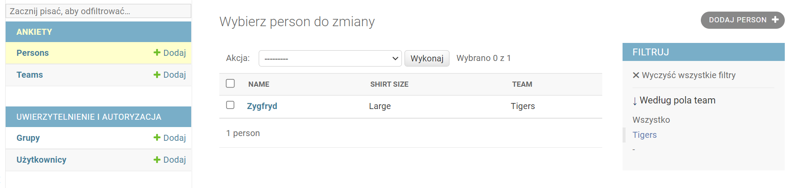

# Aplikacje WWW, semestr 2025Z

## Lab 3
---
### **1. Modele w Django. Ciąg dalszy**


Oprócz typowego mapowania obiektowo-relacyjnego klasy modeli frameworka Django oferują dużo więcej możliwości, m.in. implementację funkcji pomocniczych, określenie domyślnego porządku sortowania zwracanych krotek, określenie parametrów walidacji i inne. Poniżej zostaną zaprezentowane niektóre z możliwości wraz z przykładami użycia.

Przydatne linki do dokumentacji, które mogą się przydać w trakcie rozwiązywania zadań:
1. Lista dostępnych pól klas modeli: https://docs.djangoproject.com/pl/5.2/ref/models/fields/#model-field-types
2. Atrybuty modeli: https://docs.djangoproject.com/pl/5.2/topics/db/models/#field-options
3. Klasa QuerySet i dostępne metody: https://docs.djangoproject.com/pl/5.2/ref/models/querysets/

### Zadania

**Zadanie 1**  
Dodaj do aplikacji `posts` nowy model `Post` zgodnie z poniższą definicją:
* pole `title` typu krótki tekst, max. 150 znaków,
* pole `text` z długim tekstem,
* pole `topic`, klucz obcy do modelu `Topic`, usuwanie kaskadowe,
* pole `slug` typu `SlugField`,
* pole `created_at` typu data i czas, wartość wstawiana automatycznie w momencie dodania rekordu,
* pole `updated_at` typu data i czas, wartość aktualizowana po każdej aktualizacji instancji obiektu,
* pole `created_by`, które jest kluczem obcym do wbudowanej klasy `django.contrib.auth.User`.

**Zadanie 2**  
Zarejestruj model w panelu administracyjnym Django. Znajdź w dokumentacji modułu admin ([link](https://docs.djangoproject.com/pl/5.2/ref/contrib/admin/)) zobacz jak deklaruje się pola modelu tylko do odczytu i ustaw taką własność dla pola `created_at` modelu `Post`.

**Zadanie 3**  
Przesłoń metodę `__str__()` zdefiniowanych modeli `Category`, `Topic` oraz `Post` według poniższej instrukcji:
* `Category` - nazwa kategorii,
* `Topic` - nazwa tematu,
* `Posts` - pierwsze 5 wyrazów tekstu posta + '...' jeżeli dłuższy.

**Zadanie 4**  
Bazując na przykładzie z dokumentacji https://docs.djangoproject.com/pl/5.2/topics/db/models/#meta-options dodaj właściwość `META` sortując domyślnie model `Category` po nazwie alfabetycznie, `Topic` podobnie, a `Post` po dacie dodania od najnowszych.

**Zadanie 5**  

W panelu administracyjnym dla dodanych modeli nie są widoczne wszystkie pola na liście wszystkich obiektów lecz tylko jedno z nich (domyślnie id lub to co w przesłoniętej funkcji `__str__()`). Aby to zrobić należy najpierw zdefiniować w pliku `admin.py` klasę admin dla danego modelu (ModelAdmin), a następnie zdefiniować listę pól do wyświetlenia w zmiennej `list_display`. Przykład poniżej:

**_Listing 1_**
```python
# dla przykładowej klasy
class PersonAdmin(admin.ModelAdmin):
    # zmienna list_display przechowuje listę pól, które mają się wyświetlać w widoku listy danego modelu w panelu administracynym
    list_display = ['name', 'shirt_size']

# ten obiekt też trzeba zarejestrować w module admin
admin.site.register(Person, PersonAdmin)
```

**Zadanie 6**  
Dodaj klasy `ModelAdmin` dla wszystkich zdefiniowanych modeli i zmień listę wyświetlanych kolumn w panelu administracyjnym.

**Zadanie 7**  
Zmodyfikuj kod aplikacji tak, żeby na liście modeli `Post` w panelu administracyjnym wyświetlana została również kolumna `Topic` o postaci 'nazwa topiku (nazwa kategorii)' np. `Batman (Filmy)`. Podpowiedź: sprawdź w dokumentacji modułu admin opis działania adnotacji `@admin.display` ([link](https://docs.djangoproject.com/pl/5.2/ref/contrib/admin/#django.contrib.admin.ModelAdmin.list_display)).

---
W panelu administracyjnym możliwe jest również dodanie filtrów do widoków. Cały proces polega na dodaniu pola `filter_list` w klasie admin danego modułu:

**_Listing 2_**
```python
# przykład i wizualizacja dla modeli Person oraz Team.

class PersonAdmin(admin.ModelAdmin):
    list_filter = ['team']
```



W zależności od typu pola zostanie wyświetlony odpowiedni filtr. W przypadku niektórych rodzajów i dużej liczby unikalnych wartości używanie filtrów może być niepraktyczne ze względów wydajnościowych i wizualnych.

---

**Zadanie 8**  
Dodaj filtr dla tematów (topic), kategorii oraz użytkowników dla klasy `Post` w panelu administracyjnym.  Dodaj filtry nazw dla tematów oraz kategorii. Przetestuj działanie filtrów.

**Zadanie 9**  
Przeczytaj informację o możiwości automatycznego generowania wartości pola w dokumentacji(https://docs.djangoproject.com/pl/5.2/ref/contrib/admin/#django.contrib.admin.ModelAdmin.prepopulated_fields) i zastosuj to dla pola `SlugField` modelu `Post`, które będzie generowane z pola `title`.

**Zadanie 10**  
Korzystając z dokumentacji API klasy `QuerySet` z pkt. 3 wykonaj następujące zapytania za pomocą shella Django (**kod Pythona z zapytaniami umieść w pliku lab_3_zadanie_10.md w swoim repozytorium**):
* wyświetl wszystkie obiekty modelu `Category`,
* wyświetl obiekt modelu `Category` z id = 3,
* wyświetl obiekty modelu `Category`, których nazwa rozpoczyna się na wybraną przez Ciebie literę alfabetu (tak, żeby był co najmniej jeden wynik),
* wyświetl unikalną listę nazw kategorii ze wszystkich dodanych tematów (topików),
* wyświetl tytuły postów posortowane alfabetycznie malejąco,
* dodaj nową instancję obiektu klasy `Category` i zapisz w bazie.

**Zadanie 11**  
Jeżeli nie robiłeś/-aś tego wcześniej to zatwierdź wszystkie zmiany w danym branchu i spróbuj wykonać merge z główną gałęzią. Proponuję wykonać tę operację przy pomocy interfejsu IDE PyCharm, aby przetestować wbudowane narzędzie do wspomagania procesu merge (o ile wystąpią konflikty).