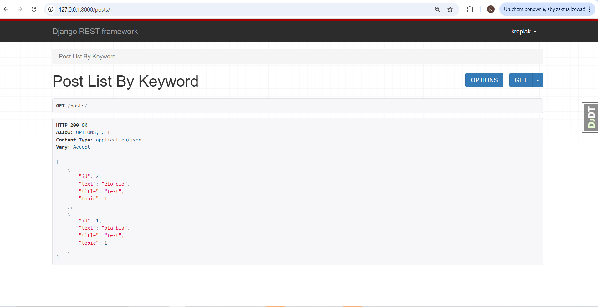

# Aplikacje WWW, semestr 2022Z

## Lab 5 - Podstawowa walidacja wewnątrz serializerów danych oraz budowa pierwszych endpoint'ów REST API.
---

### **1. Walidacja danych w procesie serializacji.**

#### **1.1 Walidacja na poziomie pojedynczego pola.**

Oprócz automatycznej walidacji wartości pól na podstawie wybranego typu pola (numeryczne, tekstowe, daty itd.) możliwe jest również zdefiniowanie reguł walidacji, które są nieco bardziej złożone lub specyficzne dla danego problemu biznesowego. Aby automatycznie przypisać taki walidator dla konkretnego pola musimy jego nazwę zdefiniowac wg. wzorca `.validate_<nazwa_pola>` wewnątrz serializera. Metoda ta przyjmuje pojedynczy argument, który jest wartością pola, które ma zostać poddane walidacji. Ta metoda zwraca zwalidowaną wartość pola lub zgłasza wyjątek `serializers.ValidationError`. Przykład poniżej.

**_Listing 1_**
```python
# fragment klasy PersonSerializer

# walidacja wartości pola name
    def validate_name(self, value):

        if not value.istitle():
            raise serializers.ValidationError(
                "Nazwa osoby powinna rozpoczynać się wielką literą!",
            )
        return value
```

Jeżeli walidacja danego pola nie powiedzie się to zmienna `.errors` przechowa stosowny komunikat o błędzie i nie pozwoli na zapisanie obiektu przed usunięciem wszystkich błędów.

#### **1.2 Walidacja na poziomie obiektu.**

Walidacja na poziomie obiektu jest potrzebna, kiedy niezbędne jest wykorzystanie dostępu do wielu pól. Przykład (z oficjalnej dokumentacji) poniżej.

**_Listing 2_**
```python
class EventSerializer(serializers.Serializer):
    description = serializers.CharField(max_length=100)
    start = serializers.DateTimeField()
    finish = serializers.DateTimeField()

    def validate(self, data):
        """
        Check that start is before finish.
        """
        if data['start'] > data['finish']:
            raise serializers.ValidationError("finish must occur after start")
        return data
```

#### **1.3 Własne i wbudowane walidatory.**

W przypadku gdy nasze reguły walidacji (oprócz już tych wbudowanych we frameworku) trzeba wykorzystać w wielu polach i wielu serializerach, najlepszym pomysłem jest zdefiniować je jako zewnętrzne funkcje lub obiekty. Można to zrobić wewnątrz pliku z kodem serializerów, ale jeszcze lepszym pomysłem będzie wyniesienie ich do oddzielnego modułu (pliku). POniżej przykład dla pierwszego przypadku (również z oficjalnej dokumentacji DRF).

**_Listing 3_**
```python
# metoda walidująca, można stworzyć oddzielny moduł z wieloma takimi metodami 
# i zaimportować w różnych miejscach projektu
def multiple_of_ten(value):
    if value % 10 != 0:
        raise serializers.ValidationError('Not a multiple of ten')

class GameRecord(serializers.Serializer):
    score = IntegerField(validators=[multiple_of_ten])
    ...
```

DRF posiada również wbudowane walidatory, które mogą służyć do walidacji np. unikalności wartości w danym zbiorze (np. tabeli w bazie danych). Przykład jego wykorzystania poniżej.

**_Listing 4_**
```python
class EventSerializer(serializers.Serializer):
    name = serializers.CharField()
    room_number = serializers.IntegerField(choices=[101, 102, 103, 201])
    date = serializers.DateField()

    class Meta:
        # Each room only has one event per day.
        validators = [
            UniqueTogetherValidator(
                queryset=Event.objects.all(),
                fields=['room_number', 'date']
            )
        ]
```

Lista oraz przykłady wykorzystania tych walidatorów znajdują się w dokumentacji pod adresem: https://www.django-rest-framework.org/api-guide/validators/


### **2. Wykorzystanie widoków APIView do tworzenia endpointów REST API.**

W odróżnienu od klasy `HttpRequest` z frameworka Django, DRF wykorzystuje rozszarzającą ją klasę `Request`, która jest lepiej przystosowana do obsługi żądań REST API. Wszelkie wartości takiego żądania znajdują się w zmiennej `request.data` w odróżnieniu od `request.POST` (klasa HttpRequest).
Do obsługi odpowiedzi wykorzystywana jest natomiast klasa `Response`, które w podstawowej formie zawiera wszelkie dane w surowej formie i dopiero w fazie negocjacji z klientem decyduje o ich postaci.

Chcąc stworzyć endpoint REST możemy wykorzystać dwa opakowania (ang. wrappers) z DRF:
* dekorator `@api_view` dla widoków opratych na funkcjach,
* klasę `APIView` dla widoków opartych na klasach.

Poniżej przykład implementacji endpointu opartego na widokach funkcyjnych.

**_Listing 5_**
```python
from django.shortcuts import render
from rest_framework import status
from rest_framework.decorators import api_view
from rest_framework.response import Response
from .models import Person, Team
from .serializers import PersonSerializer

# lista akceptowanych metod protokołu HTTP, to pozwala na zgłaszanie wyjątków
# w przypadku próby dostępu metodą spoza listy
@api_view(['GET'])  
def person_list(request):
    """
    Lista wszystkich obiektów klasy Person.
    """
    if request.method == 'GET':
        persons = Person.objects.all()
        # dane podawane są poprzez uprzednio przygotowany serializer
        serializer = PersonSerializer(persons, many=True)
        return Response(serializer.data)

@api_view(['GET', 'PUT', 'DELETE'])
def person_detail(request, pk):

    """
    :param request: obiekt DRF Request
    :param pk: id obiektu Person
    :return: Response (może zawierać dane i/lub status HTTP żądania)
    """
    try:
        person = Person.objects.get(pk=pk)
    except Person.DoesNotExist:
        return Response(status=status.HTTP_404_NOT_FOUND)

    """
    Zwraca pojedynczy obiekt typu Person.
    """
    if request.method == 'GET':
        person = Person.objects.get(pk=pk)
        serializer = PersonSerializer(person)
        return Response(serializer.data)

    """
    Aktualizacja obiekt typu Person.
    """
    elif request.method == 'PUT':
        serializer = PersonSerializer(person, data=request.data)
        if serializer.is_valid():
            serializer.save()
            return Response(serializer.data)
        return Response(serializer.errors, status=status.HTTP_400_BAD_REQUEST)

    """
    Usuwanie obiektu typu Person.
    """
    elif request.method == 'DELETE':
        person.delete()
        return Response(status=status.HTTP_204_NO_CONTENT)
```

Aby całość zadziałała jak należy, niezbędne jest dodanie również odpowienich wpisów w plikach `urls.py` odpowiednich aplikacji projektu.

Przykład poniżej.

**_Listing 6_**
```python
# plik ankiety/urls.py

from django.urls import path, include
from . import views

urlpatterns = [
    path('persons/', views.person_list),
    path('persons/<int:pk>/', views.person_detail),
]
```

Umieszczając definicje dla każdej aplikacji wewnątrz jej struktury, uniezależniamy ją jeszcze bardziej od głównego projektu i możemy łatwiej przenosić pomiędzy projektami. Wymagane jest jeszcze dołączenie tych urli w pliku `urls.py` głównego projektu.

Po poprawnej konfiguracji widok standardowy w oknie przeglądarki może wyglądać tak:




**Zadania**

1. Wykonaj zadania na nowym branchu o nazwie `feature_lab_5`. Na koniec pracy, po przetestowaniu, scal ten branch z główną gałęzią projektu.
2. Zmień implementację modelu `Osoba` tak, aby domyślną wartością pola `miesiac_dodania` był miesiąc bieżący. 
3. Dodaj również walidację dla klasy Osoba:
   * `nazwa` - może zawierać tylko litery,
   * `miesiac_dodania` - nie może być z przyszłości.
4. Bazując na przykładach z bieżącego laboratorium przygotuj endpointy dla modeli `Osoba` i `Druzyna`:
   * wyświetlanie, dodawanie i usuwanie pojedynczego obiektu typu `Osoba`,
   * wyświetlanie listy obiektów typu `Osoba`,
   * wyświetlenie listy obiektów typu `Osoba`, które zawierają w polu `nazwa` zadany łańcuch znaków,
   * wyświetlanie, dodawanie i usuwanie pojedynczego obiektu typu `Drużyna`,
   * wyświetlanie listy obiektów typu `Drużyna`.
5. Korzystając z posiadanego API wykonaj:
   * dodaj dwa nowe obiekty `Osoba` eksperymentując z różnymi polami,
   * zmodyfikuj jeden obiekt typu `Osoba`,
   * usuń jeden obiekt typu `Osoba`,
   * wyświetl wszystkie obiekty, które w nazwie zawierają literę `a`.
6. Do odpytania endpointów oprócz widoków serwowanych przez DRF wykorzystaj również program `Postman` oraz polecenie `curl` (Dokumentacja: https://curl.se/docs/manual.html).
7. Bazując na przykładzie z dokumentacji pod adresem https://www.django-rest-framework.org/tutorial/3-class-based-views/ wykonaj:
   * zatwierdź zmiany w poprzednim branchu
   * dodaj nowy branch o nazwie `feature_lab_5_class_views` i przełącz się na niego
   * zamień implementację API dla modelu `Osoba` zgodnie z przykładem z dokumentacji, rozszerzając klasę `APIView` DRF.
   * zatwierdź zmiany na branchu, ale nie zsalaj z główną gałęzią.
