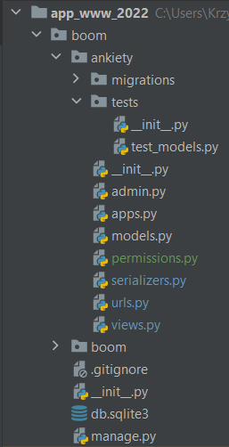

# Aplikacje WWW, semestr 2023Z

## Lab 8 - Testowanie aplikacji Django.

> **Zasoby**:
> 1. Oficjalna strona Django: https://docs.djangoproject.com/en/4.1/topics/testing/
> 2. Tutorial na stronie Mozilla Developer Network: https://developer.mozilla.org/en-US/docs/Learn/Server-side/Django/Testing
> 3. Real Python Django Testing Tutorial część 1: https://realpython.com/testing-in-django-part-1-best-practices-and-examples/
> 4. i część 2: https://realpython.com/testing-in-django-part-2-model-mommy-vs-django-testing-fixtures/ 
> 5. Tutoriale dla narzędzia Postman: https://learning.postman.com/docs/getting-started/introduction/
> 6. Dokumentacja DRF i testy: https://www.django-rest-framework.org/api-guide/testing/

### 1. Pisanie własnych testów dla aplikacji Django.

W trakcie tworzenia aplikacji Django umieszcza plik `tests.py` w jej głównym folderze. W tym miejscu możemy umieszczać kod zawierający kolejne testy automatyczne. Taki plik potrafi szybko urosnąć, więc lepszym pomysłem jest podzielenie testów między wiele plików. Można to zrobić poprzez utworzenie podkatalogu jako modułu w aplikacji i umieszczenia w nim wielu plików rozdzielających testy wg. pewnej logiki np. dla widoków, dla modeli, dla endpointów itd.

Na potrzeby przykładów zawartych w tym labie przyjęto następującą strukturę:



W pliku `test_models.py` został umieszczony jeden przykładowy test dla klasy Person.

**_Listing 1_**  

```python
from django.test import TestCase

from ..models import Person


class PersonModelTest(TestCase):
    @classmethod
    def setUpTestData(cls):
        Person.objects.create(name='Jan', shirt_size='L')

    def test_first_name_label(self):
        person = Person.objects.get(id=1)
        field_label = person._meta.get_field('name').verbose_name
        self.assertEqual(field_label, 'name')

    def test_first_name_max_length(self):
        person = Person.objects.get(id=1)
        max_length = person._meta.get_field('name').max_length
        self.assertEqual(max_length, 60)

```

Aby uruchomić teraz ten test musimy podać dość szczegółowo jego lokalizację.

```console
python manage.py test ankiety.tests
```

Jako wyjście otrzymamy podsumowanie wykonania wszystkich testów.

```console
# uruchomienie wszystkich testów w wybranym modelu
python manage.py test ankiety.tests

# uruchomienie konkretnego mudułu (pliku) ztestami
python manage.py test ankiety.tests.test_models

# uruchomienie tylko jednej klasy z testami
python manage.py test ankiety.tests.test_models.PersonModelsTest

# uruchomienie jednej konkretnej metody testującej
python manage.py test ankiety.tests.test_models.PersonModelTest.test_first_name_max_length
```

Poniżej dwa przykłady prostego testowania endpointu API z uwierzytelnianiem.

> Plik `./ankiety/tests/test_api.py`

**_Listing 2:_**
```python
from django.contrib.auth.models import User
from rest_framework.test import APIRequestFactory, APIClient
from rest_framework.test import force_authenticate
from django.test import TestCase
from ..views import *


# initialize the APIClient app
client = APIClient()


class PersonDetailTest(TestCase):
    """ Testowanie bez użycia APIClient"""

    def setUp(self) -> None:
        self.user = User.objects.create_user(username='testuser', password='12345')
        self.team = Team.objects.create(name='Loosers', country='PL')
        self.zbyszek = Person.objects.create(
            name='Zbyszek', shirt_size='L', miesiac_dodania=1, team=self.team)

    def test_get_person_detail(self):
        pk = 1
        factory = APIRequestFactory()
        request = factory.get(f'/ankiety/persons/{pk}/')

        force_authenticate(request, user=self.user)
        response = person_detail(request, pk)
        # print(response.data)  # tylko do sprawdzenia
        serializer = PersonSerializer(self.zbyszek)
        self.assertEqual(response.status_code, status.HTTP_200_OK)
        self.assertEqual(response.data, serializer.data)


class GetSinglePersonTest(TestCase):
    """ Testowanie z użyciem APIClient"""
    def setUp(self):
        self.team = Team.objects.create(name='Loosers', country='PL')
        self.user = User.objects.create_user(username='testuser', password='12345')
        client.force_authenticate(user=self.user)
        self.zbyszek = Person.objects.create(
            name='Zbyszek', shirt_size='L', miesiac_dodania=1, team=self.team)

    def test_get_valid_single_person(self):
        request = client.get(f'/ankiety/persons/{self.zbyszek.pk}/')
        person = Person.objects.get(pk=self.zbyszek.pk)
        serializer = PersonSerializer(person)
        response = request.render()
        self.assertEqual(response.data, serializer.data)
        self.assertEqual(response.status_code, status.HTTP_200_OK)

```

W zależności od projektu można przyjąć inną strukturę, ale należy pamiętać o odpowniednich ścieżkach importu modułów Django. Przykład innej organizacji imkonfiguracji można znaleźć np. tutaj: https://docs.djangoproject.com/en/4.1/topics/testing/advanced/#testing-reusable-applications

W trakcie uruchomienia testów tworzona jest nowa baza tymczasowa, więc nie będzie ona inicjalnie zawierała żadnych danych.

**Co powinniśmy testować ?**

Testowaniu powinny podlegać elementy, które mogą generować problemy w trakcie pracy aplikacji, o dość złożonej logice. To mogą być np. formularze. Możemy testować również działanie całych przepływów w aplikacji np. poprawności działania procesu logowania, pobierania danych z bazy, transakcji pomiędzy różnymi systemami.

Testy powinny również być uruchamiane przed wypychaniem danych do repo i tuż po ich pobraniu. 


**Zadania**

**Zadanie 1**  
Przygotuj wybraną przez siebie strukturę pod uruchomienie testów w swoim projekcie. Wykorzystaj przykładową klasę podaną w listingu 1, aby przetestować czy mechanizm uruchamiania testów działa poprawnie.

**Zadanie 2**  
Dopisz dodatkowe testy dla klas modeli Person oraz Team. Sprawdzaj np. czy dodanie dwóch obiektów danego modelu generuje prawidłowo identyfikatory. 

**Zadanie 3**  
Posiłkując się dokumentacją oraz przykładami z załączonych poradników, napisz test dla jednego widoku. Sprawdź poprawność statusu protokołu HTML dla żądania tego widoku.

**Zadanie 4**  
Opierając się na materiale video z wykładu oraz dokumentacji aplikacji Postman wykonaj:
* dodaj nowy workspace dla aplikacji rozwijanej na zajęciach,
* dodaj nowe API oraz wpisz jakieś podstawowe informacje o nim,
* dodaj nowe środowisko a w nim zmienną `base_url`, która będzie zawierała url bazowy do testowania wszystkich endpointów,
* dodaj nową kolekcję dla endpointu odpytującego model `Osoba`,
* do kolekcji zdefiniuj sposób uwierzytelniania dla tych żądań (można później dla każdego żądania nadpisać te ustawienia)
* w powyższej kolekcji dodaj kilka żądań (GET, POST, PUT lub PATCH), sprawdź czy działają poprawnie,
* dla tej kolekcji zdefiniuj test, który będzie uruchamiany dla każdego jego żądania (zakładka Tests) i będzie sprawdzał czy żądanie ma status 200,

**Zadanie 5**  
Bazując na dokumentacji z pkt. 6 napisz dwa testy wykorzystujące klasę `APITestCase` i:
* dla każdego z nich użyj innej metody uwierzytelniania,
* jeden test powinien przeprowadzić proces stworzenia nowego obiektu i sprawdzenia poprawności tego procesu dla przykładowych danych,

**Zadanie 6** *  
Korzystając z przykładów w tutorialu z pkt. 4 na początku bieżacego labu, zainstaluj i stwórz jeden test oparty o bibliotekę selenium.

\* nie jest obowiązkowe