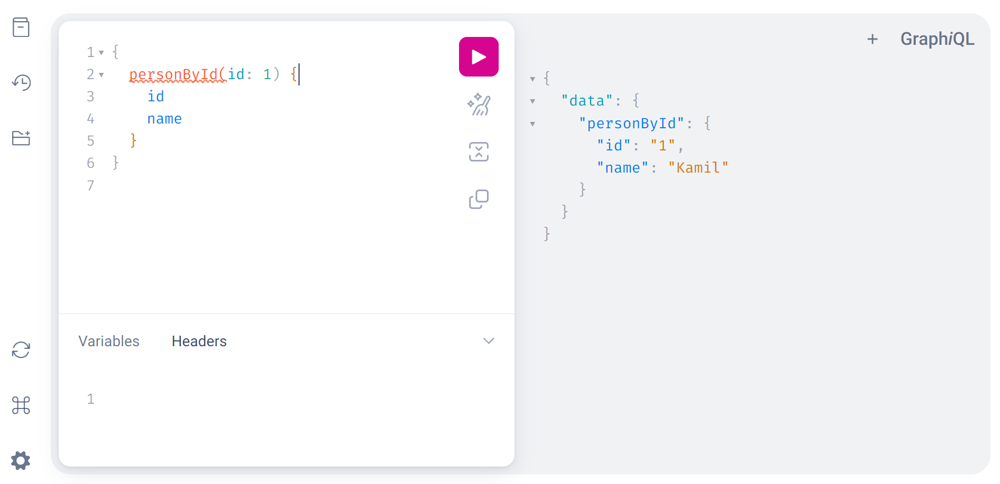
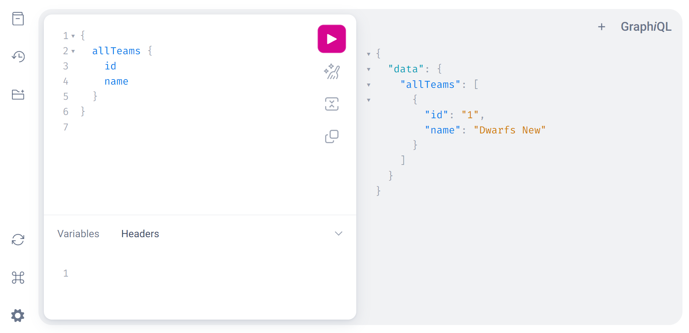
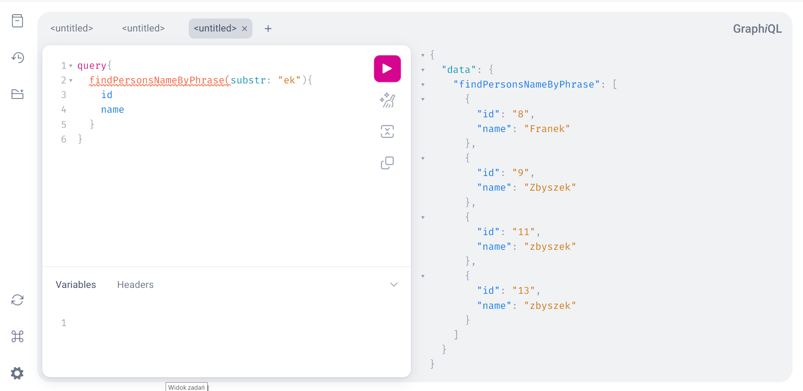
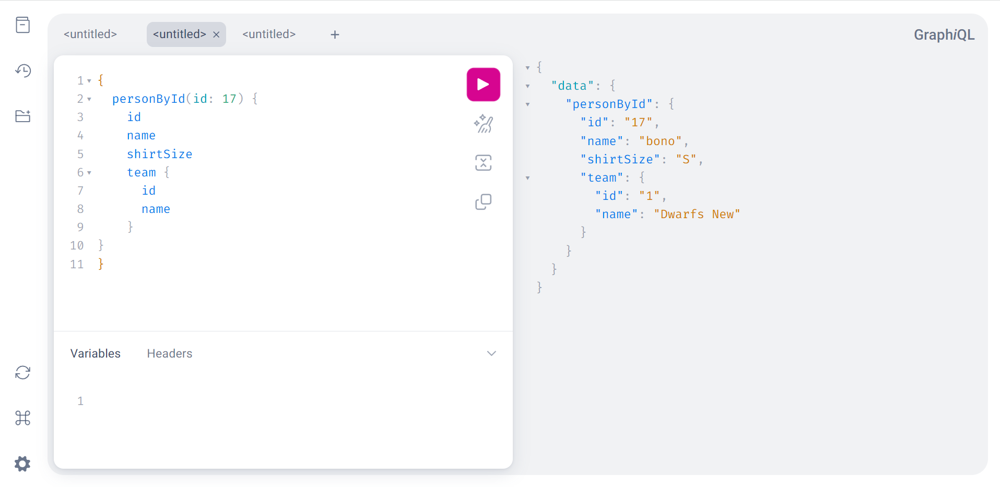

# Aplikacje WWW, semestr 2024Z

## Lab 9 - Wprowadzenie do GraphQL.

GraphQl jest językiem zapytań do API, który w odróżnieniu od REST API pozwala precyzyjnie określić listę cech obiektów, które chcemy zwrócić w zależności od potrzeb. Oznacza to, że poprawnie definiując zapytania możemy uniknąć ofektu pobierania zbyt dużej liczby danych (overfetching) lub zbyt małej (underfetching).


Poniżej znajduje się instrukcja uruchomienia modułu `graphene` pozwalającego na przetestowanie GraphQL w istniejącym projekcie Django.

**Krok 1.**

Instalacja graphene:

```bash
pip install graphene-django
```

**Krok 2.**  
Dodanie definicji do pliku `settings.py`

```python
INSTALLED_APPS = [
    ...
    "graphene_django" 
]
```

**Krok 3.**

Edycja GŁÓWNEGO pliku `urls.py`

```python
...
from django.views.decorators.csrf import csrf_exempt
from graphene_django.views import GraphQLView

urlpatterns = [
    path('admin/', admin.site.urls),
    path("graphql", csrf_exempt(GraphQLView.as_view(graphiql=True))),
]
```
**Krok 4.**

Dodanie pliku `projekt/schema.py` (tu dla mojej aplikacji ankiety) z zawartością:

```python
import graphene
from graphene_django import DjangoObjectType

from ankiety.models import Person, Team

class PersonType(DjangoObjectType):
    class Meta:
        model = Person
        fields = ("id", "name", "shirt_size", "miesiac_dodania", "team")
        # lub
        # fields = "__all__"

class TeamType(DjangoObjectType):
    class Meta:
        model = Team
        fields = ("id", "name", "country")

class Query(graphene.ObjectType):
    all_teams = graphene.List(TeamType)
    person_by_id = graphene.Field(PersonType, id=graphene.Int(required=True))
    all_persons = graphene.List(PersonType)
    person_by_name = graphene.Field(PersonType, name=graphene.String(required=True))
    find_persons_name_by_phrase = graphene.List(PersonType, substr=graphene.String(required=True))

    def resolve_all_teams(root, info):
        return Team.objects.all()

    def resolve_person_by_id(root, info, id):
        try:
            return Person.objects.get(pk=id)
        except Person.DoesNotExist:
            raise Exception('Invalid person Id')

    def resolve_person_by_name(root, info, name):
        try:
            return Person.objects.get(name=name)
        except Person.DoesNotExist:
            raise Exception(f'No Person with name \'{name}\' found.')

    def resolve_all_persons(root, info):
        """ zwraca również wszystkie powiązane obiekty team dla tego obiektu Person"""
        return Person.objects.select_related("team").all()

    def resolve_find_persons_name_by_phrase(self, info, substr):
        return Person.objects.filter(name__icontains=substr)


schema = graphene.Schema(query=Query)
```

**Krok 5.**

Dodanie wpisu do `settings.py`

```python
GRAPHENE = {
    "SCHEMA": "schema.schema"
}
```

**Krok 6.**

Uruchamiamy serwer i przechodzimy pod adres http://127.0.0.1/graphql i możemy wykonać zapytania w przedstawiony poniżej sposób z efektem widocznym po prawej stronie.






Oficjalna strona GraphQL: https://graphql.org/


**Zadania**

1. Odtwórz w swojej aplikacji kolejne kroki przedstawione w labie.
2. Dodaj jeszcze 3 dodatkowe funkcje pozwalające na odpytanie ich za pomocą GraphQL, które pozwolą np. odfiltrować obiekty po fragmencie nazwy, wyświetlić ilość obiektów z daną wartością atrybutu (np. count osób z rozmiarem koszuli L), ilość osób przypisanych do drużyny, itp.
